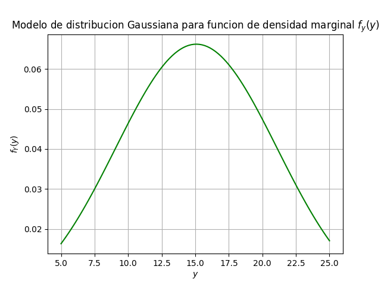

# Tarea 3. Modelos Probabilisticos de Señales y Sistemas
# Grupo 2
# Estudiante: Rubén Venegas Zúñiga - Carné: B78278
# Profesor: Fabián Abarca Calderón

## Parte 1: 
Con los datos de **xy.csv** se obtiene la función de densidad marginal de X, y se genera la 
siguiente gráfica de esta función:

Basado en la gráfica anterior se determina que los datos se pueden ajustar a un modelo 
probabilístico de densidad Gaussiana. 

Los siguientes son los parámetros obtenidos para el ajuste del modelo de fX:

**mu:  9.904843666257179**

**sigma:  3.2994430045118897**

Obteniéndose entonces la siguiente función para el modelo (Gaussiana):

Con los datos de **xy.csv** se obtiene la función de densidad marginal de Y, y se genera la 
siguiente gráfica de esta función:

Basado en la gráfica anterior se determina que los datos se pueden ajustar a un modelo 
probabilístico de densidad Gaussiana. 

Los siguientes son los parámetros obtenidos para el ajuste del modelo para fY:

**mu:  15.079460968463788**

**sigma:  6.026937738126949**

Obteniéndose entonces la siguiente función para el modelo (Gaussiana):

## Parte 2:
Si se asume independencia de X y Y entonces:

Sustituyendo por los valores encontrados en la Parte 1 se tiene:

## Parte 3:
Se obtuvieron los siguientes resultados:

**Correlacion:  149.54281000000012**

**Covarianza:  0.06669156297337238**

**Coef. Pearson:  0.003353772196327786**

## Parte 4:
Las gráficas obtenidas para los modelos que ajustan los datos de las funciones de densidad 
para marginal de X y Y son las siguientes, respectivamente:

Y la función de densidad conjunta (3D) obtenida a partir del modelo de la Parte 2 es:

